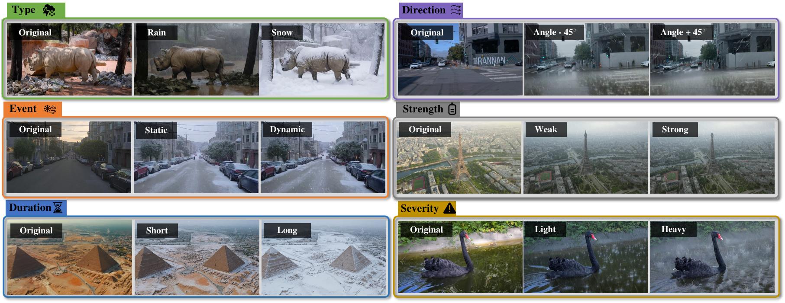
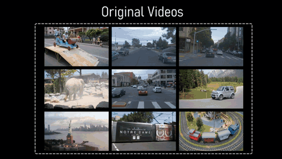
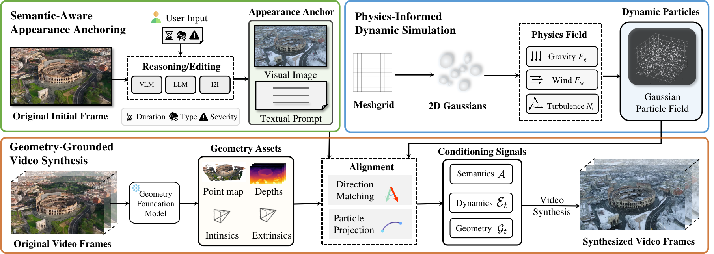

<div align="center">

# Semantic-Aware, Physics-Informed, Geometry-Grounded<br>Weather Video Synthesis

<p>
  <a href="https://jumponthemoon.github.io/w-crafter/"></a>
  <a href="https://arxiv.org/pdf/2606.29020"></a>
  
</p>

<p>
<b>Chenghao Qian</b><sup>1</sup> &nbsp;·&nbsp; Nedko Savov<sup>2</sup> &nbsp;·&nbsp; Lingdong Kong<sup>3</sup> &nbsp;·&nbsp; Yeying Jin<sup>3</sup> &nbsp;·&nbsp; Rui Song<sup>5</sup><br>
Wenjing Li<sup>1,4</sup> &nbsp;·&nbsp; Zhun Zhong<sup>4</sup> &nbsp;·&nbsp; Jiaqi Ma<sup>5</sup> &nbsp;·&nbsp; Gustav Markkula<sup>1</sup> &nbsp;·&nbsp; Luc Van Gool<sup>2</sup>
</p>

<sub>
<sup>1</sup>University of Leeds &nbsp;·&nbsp; <sup>2</sup>INSAIT, Sofia University “St. Kliment Ohridski” &nbsp;·&nbsp; <sup>3</sup>National University of Singapore &nbsp;·&nbsp; <sup>4</sup>Hefei University of Technology &nbsp;·&nbsp; <sup>5</sup>UCLA
</sub>

<br><br>



</div>

> **TL;DR** — We steer an **off-the-shelf** video diffusion editor with three structured priors —
> **semantics** (*what* the weather looks like), **dynamics** (*how* it evolves), and **geometry** (*where* it appears)
> — to synthesize diverse, physically realistic weather on real videos, **without any finetuning**.

---

## 📰 News

- **`Jun 2026`** &nbsp;🎉 Paper accepted to **ECCV 2026**!
- **`Jun 2026`** &nbsp;🌐 [Project page](https://jumponthemoon.github.io/w-crafter/) is live, with the supplementary demo video.
- **`Soon`** &nbsp;💻 Code & pretrained models — *stay tuned* (⭐ star to get notified).

---

## ✨ Highlights

- 🧩 **Tri-prior interface** — a single, structured conditioning space that factorizes weather into **semantics · dynamics · geometry**, giving precise and interpretable control.
- 🌦️ **Diverse appearance** — a *semantic-aware* strategy binds the intended weather to scene semantics via a VLM + LLM, producing varied, realistic global appearances.
- ❄️ **Physical particle dynamics** — a *physics-informed* Gaussian particle field evolves under **gravity, wind, and turbulence**, activating latent weather priors in pretrained editors for dense, coherent particles.
- 📐 **Geometry grounding** — particles are gravity-aligned and projected with camera intrinsics/extrinsics into particle-augmented depth, ensuring spatially accurate, temporally consistent placement.

---

## 🎬 Results

<div align="center">

<br><sub>Diverse weather synthesized across varied real-world scenes. &nbsp;▶️ <a href="https://jumponthemoon.github.io/w-crafter/">Full demo video on the project page</a></sub>
</div>

---

## 🧠 Method

<div align="center">

</div>

From an input video, three modules build structured conditioning — **semantic-aware appearance anchoring**
(VLM/LLM reasoning → appearance anchor), **physics-informed dynamic simulation** (a Gaussian particle field under
gravity, wind, and turbulence), and **geometry-grounded video synthesis** (geometry assets, alignment, and particle
projection). The resulting *semantics*, *dynamics*, and *geometry* signals jointly steer a frozen video diffusion model.

---

## 📚 Citation

If you find our work useful, please consider citing:

```bibtex
@inproceedings{qian2026weathervid,
  title     = {Semantic-Aware, Physics-Informed, Geometry-Grounded Weather Video Synthesis},
  author    = {Qian, Chenghao and Savov, Nedko and Kong, Lingdong and Jin, Yeying and
               Song, Rui and Li, Wenjing and Zhong, Zhun and Ma, Jiaqi and
               Markkula, Gustav and Van Gool, Luc},
  booktitle = {ECCV},
  year      = {2026}
}
```

<div align="center">
<br>
<sub>🌐 <a href="https://jumponthemoon.github.io/w-crafter/">Project Page</a> &nbsp;·&nbsp; 📄 <a href="https://arxiv.org/pdf/2606.29020">arXiv</a> &nbsp;·&nbsp; ECCV 2026</sub>
</div>
